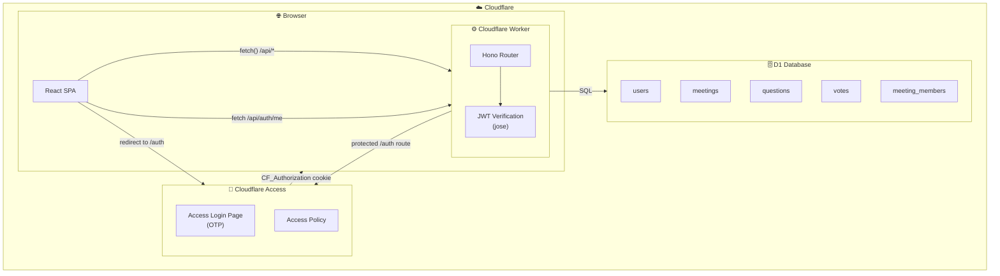

# Voting Platform

A real-time Q&A voting platform built with React Spectrum S2 and Cloudflare Workers with optional Cloudflare Access authentication.

**Live Demo:** https://voting-platform.workersdemo.com

## Quick Start

```bash
# Clone the repo
git clone <your-repo-url>
cd voting-platform

# Install dependencies
pnpm install

# Interactive setup (creates D1, KV, configures wrangler.toml)
./scripts/setup.sh

# Start local development
pnpm dev
```

## Deployment

See [DEPLOYMENT.md](DEPLOYMENT.md) for step-by-step instructions on deploying to your own Cloudflare account.

## Features

- **Public Read Access** - Anyone can view meetings and questions without authentication
- **Optional Authentication** - Users can authenticate via Cloudflare Access (One-Time PIN) to create meetings and vote
- **Guest Analytics** - Authenticated users are tracked in KV namespace for analytics
- **Dark Mode Support** - Full light/dark theme support with React Spectrum S2
- **Real-time Updates** - Polling-based updates for questions and votes
- **Fuzzy Search** - Fast question search using Fuse.js

## Architecture



### Detailed Architecture (ASCII)

```
┌─────────────────────────────────────────────────────────────────────────────┐
│                              Browser                                        │
│  ┌───────────────────────────────────────────────────────────────────────┐  │
│  │                     React SPA (Spectrum S2)                           │  │
│  │  ┌─────────────┐  ┌─────────────┐  ┌─────────────┐  ┌─────────────┐   │  │
│  │  │  HomePage   │  │ MeetingPage │  │ AdminPage   │  │  Dashboard  │   │  │
│  │  │  (/ )       │  │ (/:code)    │  │ (/:code/    │  │  (/admin)   │   │  │
│  │  │             │  │             │  │    admin)   │  │             │   │  │
│  │  │ - Create    │  │ - Questions │  │ - Settings  │  │ - All       │   │  │
│  │  │ - Join      │  │ - Voting    │  │ - Add Owner │  │   meetings  │   │  │
│  │  └─────────────┘  │ - Search    │  │ - Status    │  └─────────────┘   │  │
│  │                   │ - Sort      │  └─────────────┘                    │  │
│  │                   └─────────────┘                                     │  │
│  └───────────────────────────────────────────────────────────────────────┘  │
└─────────────────────────────────────────────────────────────────────────────┘
                                      │
                                      │ HTTP (polling every 3s)
                                      ▼
┌─────────────────────────────────────────────────────────────────────────────┐
│                        Cloudflare Workers                                   │
│  ┌───────────────────────────────────────────────────────────────────────┐  │
│  │                      Worker (itty-router)                             │  │
│  │                                                                       │  │
│  │   POST /api/meetings          - Create or join meeting                │  │
│  │   GET  /api/meetings/:id      - Get meeting details                   │  │
│  │   PUT  /api/meetings/:id      - Update meeting (owner only)           │  │
│  │   POST /api/meetings/:id/owners    - Add co-owner                     │  │
│  │   GET  /api/meetings/:id/questions - List questions (sorted)          │  │
│  │   POST /api/meetings/:id/questions - Add question                     │  │
│  │   POST /api/questions/:id/vote     - Vote up/down                     │  │
│  │   GET  /api/admin/meetings         - List all meetings                │  │
│  │                                                                       │  │
│  └───────────────────────────────────────────────────────────────────────┘  │
│                                      │                                      │
│                                      │ SQL                                  │
│                                      ▼                                      │
│  ┌───────────────────────────────────────────────────────────────────────┐  │
│  │                         D1 Database                                   │  │
│  │                                                                       │  │
│  │   ┌─────────┐  ┌───────────┐  ┌─────────────────┐  ┌───────────────┐  │  │
│  │   │  users  │  │ meetings  │  │ meeting_members │  │   questions   │  │  │
│  │   │         │  │           │  │                 │  │               │  │  │
│  │   │ id      │  │ id        │  │ meeting_id      │  │ id            │  │  │
│  │   │ email   │  │ short_code│  │ user_id         │  │ meeting_id    │  │  │
│  │   └─────────┘  │ name      │  │ role (Owner/    │  │ author_id     │  │  │
│  │                │ status    │  │        Member)  │  │ content       │  │  │
│  │                │ creator_id│  └─────────────────┘  └───────┬───────┘  │  │
│  │                └───────────┘                               │          │  │
│  │                                                            │          │  │
│  │                                              ┌─────────────┘          │  │
│  │                                              ▼                        │  │
│  │                                        ┌────────────┐                 │  │
│  │                                        │   votes    │                 │  │
│  │                                        │            │                 │  │
│  │                                        │ question_id│                 │  │
│  │                                        │ user_id    │                 │  │
│  │                                        │ type (up/  │                 │  │
│  │                                        │      down) │                 │  │
│  │                                        └────────────┘                 │  │
│  └───────────────────────────────────────────────────────────────────────┘  │
└─────────────────────────────────────────────────────────────────────────────┘
```

## Tech Stack

| Layer     | Technology                                 |
| --------- | ------------------------------------------ |
| Frontend  | React 18, React Router, Fuse.js            |
| UI        | @react-spectrum/s2 (Adobe Spectrum)        |
| Backend   | Cloudflare Workers, Hono                   |
| Database  | Cloudflare D1 (SQLite)                     |
| Auth      | Cloudflare Access (One-Time PIN)           |
| Analytics | Cloudflare KV (Guest Logbook)              |
| Build     | Vite, unplugin-parcel-macros, lightningcss |

## Commands

### Development

```bash
# Install dependencies (from monorepo root)
pnpm install

# Start development server (builds + runs wrangler)
pnpm dev

# Run wrangler with existing build
pnpm preview
```

### Building

```bash
# Production build (client + worker)
pnpm build
```

### Database

```bash
# Apply schema to local D1 database
pnpm wrangler d1 execute voting-platform --local --file=schema.sql

# Query local database
pnpm wrangler d1 execute voting-platform --local --command="SELECT * FROM meetings"

# Apply schema to remote D1 (production)
pnpm wrangler d1 execute voting-platform --remote --file=schema.sql
```

### Deployment

```bash
# Deploy to Cloudflare Workers
pnpm deploy

# Check deployment status
pnpm wrangler deployments list
```

### Debugging

```bash
# View worker logs (production)
pnpm wrangler tail

# Check wrangler configuration
pnpm wrangler whoami
```

## Authentication Flow

The application uses **Cloudflare Access** with One-Time PIN for optional authentication:

```
┌─────────────────────────────────────────────────────────────────────────────┐
│                         Authentication Flow                                 │
└─────────────────────────────────────────────────────────────────────────────┘

1. User visits app (no auth required for viewing)
   │
   ▼
┌──────────────────┐
│   Public Access  │  ← Anyone can view meetings/questions
│  (Read-Only)     │
└──────────────────┘
   │
   │ User clicks "Authenticate with Cloudflare" button
   │
   ▼
┌──────────────────────────────────────────────────────────────────────────┐
│  User navigates to /auth route                                           │
│  └─> ONLY /auth is protected by Cloudflare Access                        │
└──────────────────────────────────────────────────────────────────────────┘
   │
   │ Cloudflare Access intercepts request
   │
   ▼
┌──────────────────────────────────────────────────────────────────────────┐
│  Cloudflare Access Login Page                                            │
│  ┌─────────────────────────────────────────────┐                         │
│  │ Enter email: user@example.com               │                         │
│  │ [Send me a code]                            │                         │
│  └─────────────────────────────────────────────┘                         │
└──────────────────────────────────────────────────────────────────────────┘
   │
   │ Access checks policy → sends OTP if email allowed
   │
   ▼
┌──────────────────────────────────────────────────────────────────────────┐
│  One-Time PIN sent to email                                              │
│  └─> From: noreply@notify.cloudflare.com                                 │
│  └─> PIN: 123456 (expires in 10 minutes)                                 │
└──────────────────────────────────────────────────────────────────────────┘
   │
   │ User enters PIN
   │
   ▼
┌──────────────────────────────────────────────────────────────────────────┐
│  Access validates PIN                                                    │
│  └─> Issues CF_Authorization cookie (domain-wide)                        │
│  └─> Redirects to /auth                                                  │
└──────────────────────────────────────────────────────────────────────────┘
   │
   ▼
┌──────────────────────────────────────────────────────────────────────────┐
│  React Router: /auth → /                                                 │
│  └─> Client-side redirect to homepage                                    │
│  └─> User now has auth cookie for entire domain                          │
└──────────────────────────────────────────────────────────────────────────┘
   │
   ▼
┌────────────────────────────────────────────────────────────────────────┐
│  Subsequent API Requests                                               │
│  ┌────────────────────────────────────────────────────────────────┐    │
│  │ Headers:                                                       │    │
│  │   Cookie: CF_Authorization=<jwt>                               │    │
│  │   Cf-Access-Jwt-Assertion: <jwt>  ← Worker validates this      │    │
│  └────────────────────────────────────────────────────────────────┘    │
│                                                                        │
│  Worker validates JWT:                                                 │
│  1. Verifies signature using Cloudflare's public keys                  │
│  2. Checks AUD matches application                                     │
│  3. Extracts email from JWT payload                                    │
│  4. Logs to KV namespace (GUEST_LOGBOOK)                               │
│                                                                        │
│  Protected Endpoints (require auth):                                   │
│  • POST /api/meetings                (create meeting)                  │
│  • POST /api/meetings/:id/questions  (add question)                    │
│  • POST /api/questions/:id/vote      (vote)                            │
│                                                                        │
│  Public Endpoints (no auth):                                           │
│  • GET  /api/meetings/:id                                              │
│  • GET  /api/meetings/:id/questions                                    │
└────────────────────────────────────────────────────────────────────────┘
```

### Access Configuration

- **Access Application**: `voting-platform.workersdemo.com/auth` (path-specific protection)
- **Identity Provider**: One-Time PIN (email-based)
- **Policy**: Allow specific emails (configured via Cloudflare dashboard or API)
- **Session Duration**: 24 hours
- **Key Insight**: Only `/auth` path is protected by Access, allowing the rest of the site to remain public

## Project Structure

```
voting-platform/
├── src/
│   ├── App.tsx              # Router + Provider setup with theme
│   ├── main.tsx             # React entry point + page.css import
│   ├── worker.ts            # Cloudflare Worker (API + auth)
│   ├── styles.css           # Global CSS + lightningcss color fix
│   ├── types/index.ts       # TypeScript interfaces
│   ├── components/
│   │   ├── Header.tsx       # Auth button + profile menu
│   │   └── ThemeSwitcher.tsx # Light/Dark/System theme
│   ├── context/
│   │   └── AuthContext.tsx  # Auth state + JWT parsing
│   ├── hooks/
│   │   └── useAuth.ts       # Auth hook
│   ├── lib/
│   │   ├── api.ts           # Frontend API client
│   │   ├── api-utils.ts     # Backend utilities
│   │   └── auth.ts          # JWT verification + guest logging
│   └── pages/
│       ├── index.ts         # Barrel export
│       ├── HomePage.tsx     # Landing (create/join)
│       ├── MeetingPage.tsx  # Q&A view + voting
│       ├── MeetingAdminPage.tsx  # Meeting settings
│       └── AdminDashboard.tsx    # Global admin
├── schema.sql               # D1 database schema
├── wrangler.toml            # Worker configuration + KV binding
├── vite.config.ts           # Vite + Cloudflare plugin
└── package.json
```

## Meeting Codes

Meetings use 6-character alphanumeric codes (e.g., `ABC123`) for easy sharing:

- Characters: `ABCDEFGHJKLMNPQRSTUVWXYZ23456789` (no ambiguous 0/O, 1/I/L)
- Collision-checked on creation
- Used in URLs: `https://your-app.com/ABC123`

## Important: React Spectrum S2 + Vite Setup

This project uses React Spectrum S2 which requires specific build configuration:

### Required Dependencies

```bash
pnpm add @react-spectrum/s2
pnpm add -D unplugin-parcel-macros lightningcss
```

### Vite Configuration

```ts
// vite.config.ts
import macros from 'unplugin-parcel-macros';

export default defineConfig({
  plugins: [
    macros.vite(), // Must be first!
    react(),
  ],
  build: {
    cssMinify: 'lightningcss', // REQUIRED for S2
    rollupOptions: {
      output: {
        manualChunks(id) {
          if (/macro-(.*)\.css$/.test(id) || /@react-spectrum\/s2\/.*\.css$/.test(id)) {
            return 's2-styles';
          }
        },
      },
    },
  },
});
```

### Color Theme Fix

S2's `Provider` component with `background="base"` sets background colors but **not text colors**. You need to add this CSS rule:

```css
/* styles.css */
._pa12,
._pb12,
._pc12 {
  color: var(--lightningcss-light, rgb(41, 41, 41)) var(--lightningcss-dark, rgb(219, 219, 219));
}
```

This matches the pattern used throughout S2 (e.g., icon colors) and ensures `Heading` and `Text` components inherit the correct color in both light and dark modes.

### Environment Variables

| Variable                | Description                                                                        |
| ----------------------- | ---------------------------------------------------------------------------------- |
| `APP_NAME`              | Application identifier for guest tracking                                          |
| `CF_ACCESS_TEAM_DOMAIN` | Your Cloudflare Access team domain (e.g., `https://yourteam.cloudflareaccess.com`) |
| `CF_ACCESS_AUD`         | Application Audience tag from Access dashboard                                     |

### Guest Logbook (KV)

Query tracked guests using wrangler:

```bash
# List all tracked guests
pnpm wrangler kv key list --namespace-id=d21d4532cc77414981dade8684be6c24

# Get details for a specific guest
pnpm wrangler kv get "guest@example.com" --namespace-id=d21d4532cc77414981dade8684be6c24
```

Each entry tracks:

- First and last seen timestamps
- Apps used (with visit counts)
- Total visits across all apps
